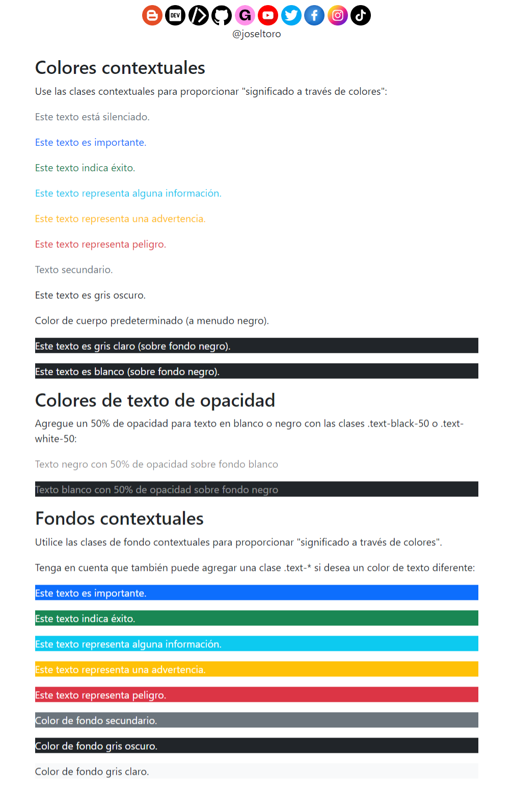

# Bootstrap 5 | Colors

📒 Colores de texto

    📝Bootstrap 5 tiene algunas clases contextuales que se pueden usar para proporcionar "significado a través de los colores".

    📝Las clases para los colores del texto son: .text-muted, .text-primary, .text-success, .text-info, .text-warning, .text-danger, .text-secondary, .text-white, .text-dark, .text-body (color de cuerpo predeterminado/a menudo negro) y .text-light:

    📝También puede agregar un 50% de opacidad para texto en blanco o negro con las clases .text-black-50 o .text-white-50:
    
📒 Colores de fondo

    📝Las clases para los colores de fondo son: .bg-primary, .bg-success, .bg-info, .bg-warning, .bg-danger, .bg-secondary, .bg-dark y .bg-light.

    📝Tenga en cuenta que los colores de fondo no establecen el color del texto, por lo que en algunos casos querrá usarlos junto con una clase de color .text-*.

Redes sociales:

- https://instagram.com/dev.joseltoro
- https://facebook.com/devjoseltoro
- https://tiktok.com/@dev.joseltoro
- https://dev.to/joseltoro
- https://code.dcoder.tech/profile/joseltoro
- https://joseltoro.blogspot.com/
- https://joseltoro.gumroad.com/